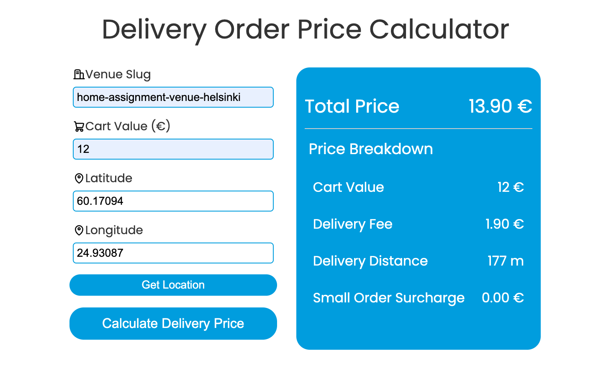

# Delivery Order Price Calculator(DOPC)

## 1. Introduction
This project is a submission for the **[Wolt Frontend Internship 2025](https://github.com/woltapp/frontend-internship-2025?tab=readme-ov-file#submitting-the-solution)**. This Delivery Order Price Calculator (DOPC) is an imaginary frontend that is capable of calculating the total price and price breakdown of a delivery order.

DOPC integrates with the Home Assignment API to fetch venue-related data required to calculate the prices. The term venue refers to any kind of restaurant/shop/store in Wolt.

## 2. Features
- **Delivery Fee Calculation**: Calculates fees based on cart value, distance ranges, and venue-specific rules.
- **Geolocation**: Uses `navigator.geolocation` to obtain the user’s latitude and longitude, with error handling for denied permissions, timeouts, or unavailable positions.
- **Input Validation**: Ensures valid numeric input for cart value and latitude/longitude inputs.
- **Error Messages**: Displays detailed error messages when input fails validation.

## 3. Technology
- **React + TypeScript** for building the user interface.
- **CSS** for styling the form and error messages.
- **Vitest / React Testing Library**for unit and integration tests.
  
## 4. Installation & Setup
1. **Install dependencies**:
    ```bash
    npm install
    ```
2. **Start the development server**:
    ```bash
    npm run dev
    ```



## 5. Usage
1. **Venue Slug**: Enter the slug corresponding to a specific venue (used to fetch venue data like base price or distance ranges).
2. **Cart Value**: Enter a positive numeric value.
3. **Coordinates**: Either manually type latitude and longitude or click **Get Location** to use your device’s geolocation.
4. **Calculate Delivery Price**: Submit the form and display the calculated delivery fee.

## 6. Implementation Details
### Delivery Fee Calculation
- Located in a utility function (e.g., `calculateFee.ts`).
- Considers minimum cart value, distance brackets, and a base price.
- Returns a detailed object with the final fee and breakdown information.

### Error Handling & Validation
- **Cart Value** must be a valid number greater than 0.
- **Slug** must be provided. An error appears if the venue data cannot be fetched.
- **Coordinates** can be manually entered or gotten from geolocation. Missing or invalid values produce an error message.


## 7. Testing
Tests are included:

```bash
npm run test
```

## 8. Conclusion
I'm really happy that I got the opportunity to spend these two weeks on the DOPC - this project proved to be a lot of fun and full of learning! It made me sure that these are the technologies I want to work with. 

It was not an easy two weeks. The last proper projects I worked on with React were from over a year ago. If I had more time, I would love to work on cleaning my code, making it more efficient, and spending more time on designing an even better interface. This time I wanted to refresh my CSS skills so I decided to not use any UI component libraries or CSS frameworks, but for my next project I would like to explore some other design approaches such as Tailwind.

Thinking about error handling was also a fun part to me. What would be the clearest and least stressful UX for users? This was a good exercise, but next time I'd like to try using something like React Hook Form and maybe react-toastify to make creating and validating forms and handling (and showing) errors a better experience for the user.

Overall, I am satisfied with what I could learn from the assignment, although I wish I had the chance to continue developing the solution further towards perfection.


